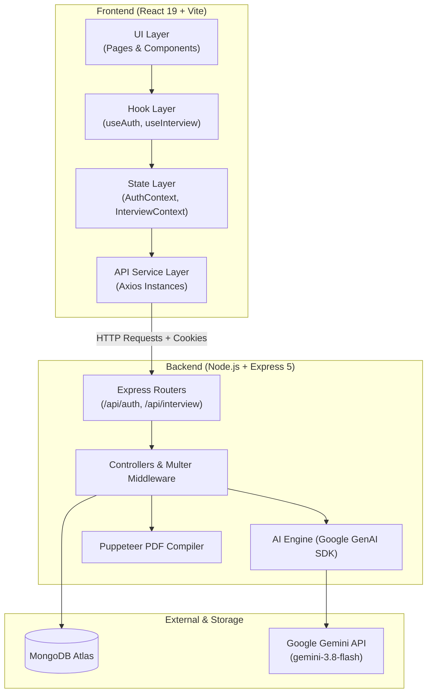

# Skillens ⚡

> **AI-Powered Interview Intelligence, Competency Analysis & Career Strategy Engine.**

Skillens turns ambiguous job specifications and candidate resumes into a decisive competitive advantage. Powered by Google Gemini AI, it evaluates role-fit, identifies critical skill gaps, synthesizes tailored technical and behavioral questions with model responses, and constructs an actionable day-by-day preparation roadmap—complete with an ATS-friendly, role-tailored PDF resume export.

---

## 🌟 Key Features

* **🎯 Semantic Match Scoring**: Deep AI-driven semantic comparison between your resume and the target job description with qualitative readiness grading.
* **💡 High-Yield Interview Scenarios**:
  * **Technical Questions**: Tailored system design, architecture, and coding questions reflecting the exact tech stack in the job spec.
  * **Behavioral Questions**: Role-specific STAR-methodology scenarios targeting communication, leadership, and conflict resolution.
  * **Evaluation Objectives**: Revealing the *interviewer's hidden intention* alongside concrete model answers.
  * **1-Click Copy & Search**: Instant full-text filtering across all questions and one-click answer copying.
* **🗺️ Interactive Daily Roadmap**:
  * 7 to 14-day progressive preparation plan with structured daily focus themes.
  * Interactive task checklist with persistent progress tracking via `localStorage`.
* **📄 Tailored ATS-Optimized Resume Export**:
  * Automatically generates and compiles a customized, role-aligned PDF resume via headless Puppeteer.
* **🎨 Modern Obsidian Dark Design System**:
  * Purpose-built for developers with deep slate surfaces, vibrant indigo/violet accents, radial match score gauges, and responsive mobile-first layouts.
* **🔒 Secure Session Authentication**:
  * JWT stored in HTTP-only cookies, password hashing via Bcrypt, and token blacklisting for secure logouts.

---

## 🏗️ System Architecture

Skillens follows a structured **4-Layer Architecture** on the frontend paired with an Express REST backend and Google Gemini AI services:



---

## 💻 Tech Stack

### Frontend
| Technology | Description |
|---|---|
| **React 19** | Modern UI framework with JSX transform and React Hooks |
| **Vite** | Next-generation frontend build tooling and HMR dev server |
| **React Router v8** | Declarative client-side routing with protected route guards |
| **Sass (Dart Sass)** | Custom modular design tokens, animations, and responsive stylesheets |
| **Lucide React** | Clean, lightweight icon suite |
| **Axios** | HTTP client configured with credentials for cookie-based auth |

### Backend
| Technology | Description |
|---|---|
| **Node.js & Express 5** | High-performance asynchronous REST API server |
| **MongoDB & Mongoose 9** | NoSQL database modeling users, reports, and token blacklists |
| **@google/genai** | Official Google GenAI SDK for Gemini models (`gemini-3.8-flash`) |
| **Puppeteer** | Headless Chrome browser for compiling ATS HTML resumes to PDF |
| **PDF-Parse** | High-speed text extraction from candidate resume PDFs |
| **Multer** | Multipart form-data handling for file uploads |
| **JWT & BcryptJS** | Secure cryptographic password hashing and authentication tokens |

---

## 📂 Repository Structure

```
Skillens/
├── 4_layer_arch.md               # 4-layer architecture design notes
├── README.md                     # Project documentation
├── Backend/                      # Node.js Express REST API
│   ├── server.js                 # Server entry point & DB connection
│   ├── package.json
│   └── src/
│       ├── app.js                # Express app setup & CORS middleware
│       ├── config/               # Database connection configuration
│       ├── controllers/          # Request handlers (auth, interview)
│       ├── middlewares/          # JWT auth & Multer file upload
│       ├── models/               # Mongoose schemas (User, InterviewReport)
│       ├── routes/               # API route definitions
│       └── services/             # Gemini AI integration & PDF generator
└── Frontend/                     # React 19 Single Page Application
    ├── index.html                # HTML template with Google Fonts
    ├── package.json
    ├── vite.config.js
    └── src/
        ├── App.jsx               # Context providers & router wrapper
        ├── app.routes.jsx        # Route configuration
        ├── components/           # Reusable components (Navbar, CinematicLoader)
        ├── features/
        │   ├── auth/             # Auth pages (Login, Register), hooks, services
        │   └── interview/        # Interview studio, report workspace, hooks
        └── styles/               # Design tokens, variables, global styles
```

---

## 🚀 Getting Started

### Prerequisites
* **Node.js**: v18.x or higher
* **npm**: v9.x or higher
* **MongoDB**: A running local instance or a free [MongoDB Atlas](https://www.mongodb.com/cloud/atlas) cluster URI
* **Google Gemini API Key**: Obtainable from [Google AI Studio](https://aistudio.google.com/)

---

### 1. Backend Setup

1. Navigate to the `Backend` directory:
   ```bash
   cd Backend
   ```

2. Install dependencies:
   ```bash
   npm install
   ```

3. Configure environment variables:
   Create a `.env` file in the `Backend` directory:
   ```env
   PORT=3000
   MONGO_URI=mongodb+srv://<username>:<password>@cluster0.mongodb.net/skillens
   JWT_SECRET=your_super_secret_jwt_key_here
   GOOGLE_GENAI_API_KEY=your_gemini_api_key_here
   ```

4. Start the backend server:
   ```bash
   # Development with automatic watch / nodemon
   npm run dev

   # Or standard node
   node server.js
   ```
   *The server will start on `http://localhost:3000`.*

---

### 2. Frontend Setup

1. Navigate to the `Frontend` directory:
   ```bash
   cd ../Frontend
   ```

2. Install dependencies:
   ```bash
   npm install
   ```

3. Launch the Vite development server:
   ```bash
   npm run dev
   ```
   *The application will be accessible at `http://localhost:5173`.*

4. To build for production:
   ```bash
   npm run build
   ```

---

## 📡 API Reference

### Authentication Endpoints (`/api/auth`)

| Method | Endpoint | Description | Auth Required |
|---|---|---|---|
| `POST` | `/api/auth/register` | Register a new user (`username`, `email`, `password`) | No |
| `POST` | `/api/auth/login` | Log into an existing account (`email`, `password`) | No |
| `GET` | `/api/auth/logout` | Invalidate token and clear session cookie | Yes |
| `GET` | `/api/auth/get-me` | Retrieve authenticated user profile | Yes |

### Interview Endpoints (`/api/interview`)

| Method | Endpoint | Description | Auth Required |
|---|---|---|---|
| `POST` | `/api/interview/generate-interview-report` | Upload resume (`multipart/form-data`) & JD to synthesize a plan | Yes |
| `GET` | `/api/interview` | Retrieve all past interview plans for the logged-in user | Yes |
| `GET` | `/api/interview/:id` | Fetch full report details by Interview Report ID | Yes |
| `POST` | `/api/interview/resume/pdf/:id` | Compile and download an ATS-tailored PDF resume | Yes |

---

## 💡 Usage Workflow

1. **Sign Up / Sign In**: Create an account or log in through the dual-pane authentication portal.
2. **Input Target Role**: Paste the target job description (or use the *Paste Example* helper).
3. **Upload Resume**: Drag and drop your current resume (PDF or DOCX format).
4. **AI Generation**: Watch the cinematic progress loader as Gemini extracts competencies, calculates match score, drafts questions, and maps out a preparation sprint.
5. **Practice & Execute**:
   * Study role-specific technical questions and model answers.
   * Review behavioral prompts and interviewer intentions.
   * Work through the daily roadmap checklist and track your completion rate.
   * Click **Download Tailored Resume** to export an ATS-optimized PDF specifically aligned to the position.

---

## 🛠️ Troubleshooting

* **Gemini 429 (Rate Limit Exceeded)**:
  If you encounter `RateLimitError: 429 Quota exceeded for metric: generate_content_free_tier_requests`, wait 10 seconds before triggering another generation or review your quota tier in [Google AI Studio](https://ai.dev/rate-limit).
* **Resume Parsing Issues**:
  Ensure your uploaded PDF contains selectable text (not a scanned raster image) so `pdf-parse` can extract the textual content accurately.

---

## 📄 License

This project is licensed under the [ISC License](LICENSE).
